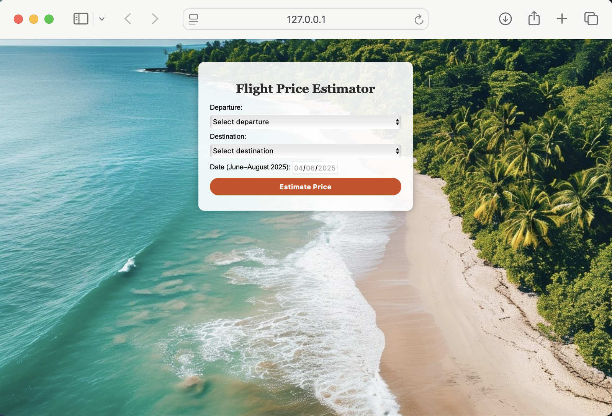

# ✈️ Flight Price Estimator

## Demo

*Example prediction interface showing route selection and estimated flight price.*

### Example Prediction Result

After submitting the form, the application returns an estimated flight price:

Estimated price: **CHF 238.19**

This project is an end-to-end machine learning application designed to predict flight ticket prices based on key travel attributes such as route, departure date, airline, and number of stops.

The application allows users to input travel details and receive an estimated ticket price, simulating a real-world pricing assistant.

This project was developed in collaboration with **Axelle Carnot**.

---

## Why This Project is Useful

Flight prices are highly dynamic and influenced by multiple factors, making it difficult for travelers to know whether a price is reasonable or if they should wait before booking. This project addresses that problem by providing a data-driven estimate of flight prices.

### Key Benefits

- **Price Awareness**  
  Helps users understand whether a flight price is relatively high or low based on historical patterns.

- **Better Decision Making**  
  Supports users in deciding when to book flights by providing an estimated fair price.

- **Real-World Application of Machine Learning**  
  Demonstrates how machine learning can be applied to practical problems in travel and pricing.

- **End-to-End Pipeline Demonstration**  
  Showcases the full lifecycle of a data science project:
  1. Data collection (web scraping)  
  2. Data preprocessing  
  3. Model training  
  4. Deployment via a web app  

- **Scalable Foundation**  
  The system can be extended to include more routes, real-time data updates, or more advanced models.

---

## Overview

The goal of this project is to build an end-to-end machine learning pipeline that:

- Collects flight data from **Booking.com**  
- Cleans and processes the data  
- Trains a predictive model  
- Serves predictions through a web interface  

The final result is a Flask-based web app where users can estimate flight prices between major European cities.

---

## Features

- Flight price prediction using a trained Random Forest model  
- User-friendly web interface  
- Data preprocessing and feature engineering pipeline  
- Modular project structure (data → model → app)  

---

## Data Pipeline

1. **Data Collection**  
   Flight data is scraped from **Booking.com Flights** using a custom script (`src/preprocessing/scrape_flights.py`).  
   *(Requires ScrapingBee API key — optional step)*

2. **Data Cleaning & Processing**  
   Raw scraped data is cleaned and transformed into a structured dataset.

3. **Model Training**  
   A Random Forest model is trained using:
   - airline  
   - route (origin & destination)  
   - number of stops  
   - departure time  
   - days until flight  

4. **Prediction**  
   The trained model is used in a Flask app to generate real-time predictions.

---

## Project Structure

```
flight-price-estimator/
│
├── data/
│   ├── raw/
│   └── full_list_of_clean_flight_data.csv
│
├── src/
│   ├── preprocessing/
│   │   └── scrape_flights.py
│   ├── model/
│   │   └── ml_model.py
│
├── webapp/
│   ├── web_app.py
│   ├── templates/
│   └── static/
│
├── requirements.txt
└── README.md
```

---

## Installation

```bash
git clone https://github.com/val-lilu/flight-price-estimator.git
cd flight-price-estimator
```

```bash
python -m venv venv
source venv/bin/activate
```

```bash
pip install -r requirements.txt
```

---

## Usage

### Train the model

```bash
python src/model/ml_model.py
```

### Run the web app

```bash
python webapp/web_app.py
```

Open:
http://127.0.0.1:5002

---

## Notes

- Model files (`.pkl`) are not included due to size limits  
- Train the model locally before running the app  
- Scraping script requires an API key  

---

## Tech Stack

- Python  
- Pandas  
- Scikit-learn  
- Flask  
- BeautifulSoup  

---

## Authors

- Valeriia Lutoshkyna  
- Axelle Carnot  
